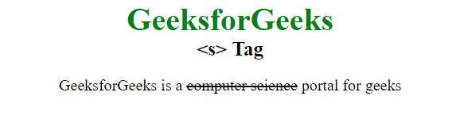
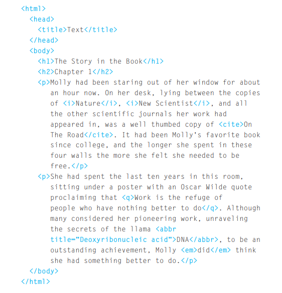
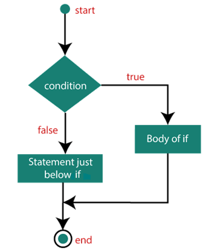
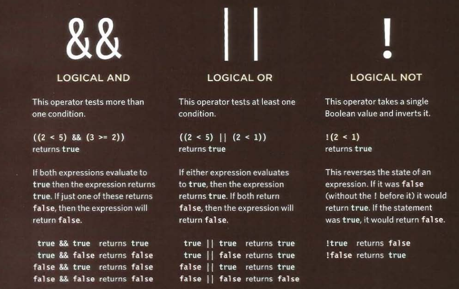
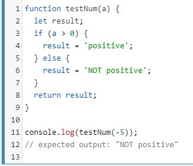

# class : 02

## tags ar know as markup
* structural markup 
* semantic markup

# lets talk about tags :

1- heading tags < h > are frome 1-6
the main heading is < h1 > and the other are subheading.

2- praghraph < p > its used to to creat pragraph, also every pragraph will start on new line 

3- the < b > tag wich used to make the font blod

4- the < i > tag wich used to make the font italic 

5- the < sub > it used to contain chracter that should be subscript

6- the < sup > to contain characters that should be superscript such as the suffixes of dates

7- the < br /> it used to remove the new line btween paragraph

8- < hr /> To create a break between themes such as drawing lin btween themes.

9- the < strong > to make content has strong importance. almost it wil look like blod 

10- < em > to  subtly changes the meaning of a sentence. it will look lik the italic font 

11- the < blockquote > used for longer quotes that take up an entire paragraph.

12- < q > its ysed for short quotes. 

13- < abbr > its will keep the first letter captilized. 

14- < cite > element can be used to indicate where the citation is from

15- < dfn >  element is used to indicate the defining instance of a new term.

16- < address >  to contain contact details for the author of the page

17- < s > element indicates something that is no longer accurate or relevant
 **example**
 

 **asimple example explain the above**
 

 # let's see what is CSS ?
 

 # how CSS works ?
 c

 #  how CSS rules apply to HTML pages?

 first you have to know that CSS rule contains tow parts: a *selector* and a *declaration.*

 **example of how CSS rule look like **
  

note: *ther is alot of selector type serch about them it will make things gose esier*

  CSS declarations sit inside curly brackets and each is made up of two parts: a property and a value separated by a colon. You can specify several properties in one declaration, each separated by a semi-colon

  ## how to link the CSS sheet with the HTML sheet ?

  its by using the < link > tag tell the browser where to find the CSS file used to style the page. also its live in the < head > elment. 
  **thats was about using external CSS**

  **lets talk about internal CSS**
  you can use it in side the HTML sheet by the type attribute to indicate that the styles are specified in
CSS.

###  why you shoul use the external CSS style sheet ?

* Allows all pages to use the same style rules (rather than repeating them in each page).

* Keeps the content separate from how the page looks.

* Means you can change the styles used across all pages by altering just one file (rather than each individual page.
  
# what you have to know about javascript?

is is an  instructions the computer follow them in the order line and if one of instruction not work it will stop ther and dosnt contninue.

note: ***You should write comments to explain what your code does. They help make your code easier to read and understand.This can help you and others who read your code.***
 how to write the comment ?
 /* btween this you can rplace the comment */

 ## what is the vairable in javaScript?
 Variable means anything that can vary. JavaScript includes variables which hold the data value and it can be changed anytime.

* we have to declare the vairable, as giving it a name.

example:
var area; 
the area is the variable name, and the var is the key word of varible.

* you can assign a value to the virble but how ?

example 
area = 3;
the equal sign is the assignment operator.

## what isrules for NAMING VARIABLES ?

1- The name must begin with a letter, dollar sign ($),or an underscore (_). It must not start with a number.

2- The name can contain letters, numbers, dollar sign ($), or an underscore (_). Note that you must not use a dash(-) or a period (.) in a variable name. 

3 - You cannot use keywords or reserved words. 

4- All variables are case sensitive,so score and Score would be different variable names.

5-Use a name that describes the kind of information that the variable stores.

6- If your variable name is made up of more than one word, use a capital letter for the first letter of every word after the first word.

## array 
is a special type of variable. It doesn't just store one value; it stores a list of values.

## how to CREATING AN ARRAY?

note: **JavaScript distinguishes between numbers (0-9), strings (text), and Boolean values (true or false).**

## expression:
it evaluates into **result in** asingle value.
1- assign avalue to varible
2- operators, allow programers to creat single value.

    * assignment operetor: assignment value to virable.
    * arthmetic operetors :perfom basic math 
    * strange opertors : combin tow string operators.
    * copsrison operators: compar tow value and retarn to true or fals 
    * logical operators : combain expression and retarn to true or fals .

note : **Expressions rely on operators to calculate a value.**

# decision:

You can analyze values in your scripts to get knw what is the expected result, then using the results of
evaluations, you can decide which path your script should go down.*thats is the decision* 

ther are tow coponents to a decision :
1- an expression is evaluted, which return as value.
2- a conditional statment that says to do an given sitution.

**comparision operators:**

| equle to '=='           |  compare tow value, to see if they are same.
|-------------------------|  
| is not equle to '!=='   |  compare tow value, to see if they are not same.
|-------------------------|
| strict equle to '==='   |  check the both data typing and value are the same.
|-------------------------|
| strict equle to '!==='  |  check the both data typing and value are not the same.

**logical operators:**

## if statment 
The if statement executes a statement if a specified condition is truthy. If the condition is falsy, another statement can be executed.

as you see in the example they used else to give another task for the 'if statment' if it return fals.

  

 

