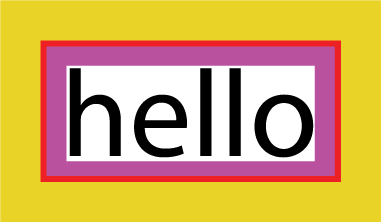
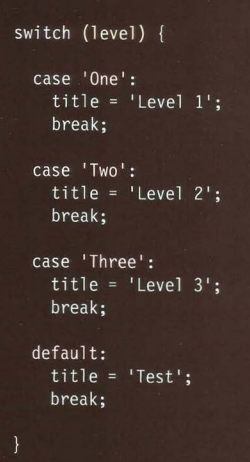

# list:

* order list: 
where each item in the list is numbered the order list created with perants <ol> 
each item in the ist placed n <li> tag

**note: you can use type attribute with the <ol> tag to specify the type numbering (number,letter)**

* unordered ist:

the list that begin with a bullet point 
it created by the peasant <ul> and the item listed place i <ul>tag 

**note:<li> stang for list item** 
**note:you can specify type of bullet point (circles,diamond,square ....) using type attribute inside <ul> tag.**

* definition list:

made up of set of terms long with definition for each of those terms. 
its created by the peasant's <dl> , you usually add <dt>&<dd>
<dt> used to contain the term being defined 
<dd> used to contain the definition.

* nested list:

you can put second list inside an <li> to create sub list or nested list.(example from google)

# boxes:

* controlling size of boxes 
box dimensions:
width,height 
*the best practice to specify the size of box are to use pixels.*

**note:designers have recently started to use percentages and ems to creates designs that fixable across devices that have different size screen.**

1- limiting width: 
 
its specify the smallest size box can be displayed when the browser window is norw.

* max width:
indicates the maximum width a box can be stretch to when the browser window is wide.

* min-height:
to limit the hight 

* max-height:
to max the hight.

**note:if the box is not enough to hold the content and content expamd outside.to control it you can use the overflow**
# ovreflowing content:

its tells the browser what to do if the content is larger than the box.
* what it do?

1- hidden: hides any extra content doesn't fit 
2- scroll:adds scroll bar to the box.

* to control the box appearance:

- ***border***:separates the edge of one box from another 

- ***margin***: outside edge of border .

- ***padding**:its is the space between the border of box and any content contained within it (use google  to

* how to centering content?

ust set the left-margin and right margin to auto.
**note:text-align property is inherited by child element.**

* change inline/block:
display:hide element forme the page or turn an inline into block-level.
how to create more complex shape?
you can target just one corner using the individual properties for the corner.

# what is array ?
its a spacial type of variable, it doesn't  just store on a value it stor a listed value.

## how to create an array ?

* you give it a name like other variable.

* the values are assigned to the array inside of square bracket.

**note: the value don't need to be same data type**

## how to numbering items in array ?
its automatically given number called index, and index value start at 0 not 1.

## how to changing value in an array?

* first to access value from an array , after the array name you specify the index number for that value 

* seconde you can change the value og an item in array by selecting it and assigning the new value.

# if .. else statement :

**what it dose do ?**
its check the condition, if it resolves true the first code block executed. if it resolves to false second code bloc is run.

**what is the using of else statement?**

allows you to provide two sets of code:
1. one set if the condition evaluates to true
2. another set if the condition is false

# what is the structure of  switch statement ?

**why do we use the switch statement ?**

the purpose of the switch statement is to present the user with a different message depending on which level they are at. The message is stored in a variable called msg.

# what is the loop?
JavaScript loops are used to repeatedly run a block of code

* wht is the structure of the while loop?
inti:
while (condition){
do statment;
update;
}

**note: A for loop is often used to loop through the items in an array.**

## what is the structure of for loops?

for (inti;condition;update){
statement;
}

**note: A for loop is often used to loop through the items in an array.**

### key words :

***break***
tells the interpreter to go onto the next statement of code outside of the loop.

***continue***
 tells the interpreter to continue with the current iteration, and then check the condition again.

 **note : It is important to remember that when a browser comes across JavaScript, it will stop doing anything else until it has processed that script**

