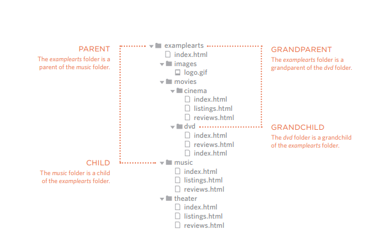

# class 04

## LINKS

### Writing Links

Links are created using the -a- element. Users can click on anything between the opening -a- tag and the closing -/a- tag. You specify which page you want to link to using the href attribute.

Links are created using the -a- element which has an attribute called href. The value of the href attribute is the page that you want people to go to when they click on the link.

When you link to a different website, the value of the href attribute will be the full web address for the site, which is known as an absolute URL.

#### Opening Links in a New Window

If you want a link to open in a new window, you can use the target attribute on the opening -a- tag. The value of this attribute should be _blank.

#### Linking to a Specific Part of the Same Page 

Before you can link to a specific part of a page, you need to identify the points in the page that the link will go to. You do this using the id attribute (which can be used on every HTML (element), also X You can use the id attribute to target elements within a page that can be linked to.

### Linking to Other Pages on the Same Site

You can use a shorthand known as a relative URL. If all the pages of the site are in the same folder, then the value of the href attribute is just the name of the file.

#### Relative URLs
which are a shorthand way to tell the browser where a page is in relation to the current page. without needing to write the domain name 

| Relative Link Type         | EXPLAIN                  
|----------------------------| --------------------------------------------------------|
| Same Folder                | To link to a file in the same folder, just use the file |
|                            |  name. (Nothing else is needed.)                        |
|----------------------------|---------------------------------------------------------|
| Child Folder               | For a child folder, use the name of the child folder    |
|                            | followed by a forward slash, then the file name.        |
|----------------------------|---------------------------------------------------------|
| Grandchild Folder          | Use the name of the child folder, followed by a forward |
|                            | slash, then the name of the grandchild folder, followed |
|                            | by another forward slash, then the file name            |
|----------------------------|---------------------------------------------------------|
| Parent Folder              | Use ../ to indicate the folder above the current one,   |
|                            | then follow it with the file name.                      |
|----------------------------|---------------------------------------------------------|     
|GrandParent Folder          | Repeat the ../ to indicate that you want to go up two   |
|                            | folders (rather than one),then follow it with the file  |
|                            | name.                                                   | 
     

### Directory Structure

### Email Links

To create a link that starts up the user's email program and addresses an email to a specified email address you use the -a- element. However, this time the value of the href attribute starts with mailto: and is followed by the email address you want the email to be sent to.

## Layout

*  -div- elements are often used as containing elements to group together sections of a page.
* Browsers display pages in normal flow unless you specify relative, absolute, or fixed positioning.
* The float property moves content to the left or right of the page and can be used to create multi-column layouts. (Floated items require a defined width.)
* Pages can be fixed width or liquid (stretchy) layouts.
* Designers keep pages within 960-1000 pixels wide, and indicate what the site is about within the top 600 pixels (to demonstrate its relevance without scrolling).
* Grids help create professional and flexible designs
* CSS Frameworks provide rules for common tasks.
* You can include multiple CSS files in one page.

## Functions, Methods, and Objects

Functions allow you to group a set of related statements together that represent a single task.
Functions can take parameters (information required to do their job) and may return a value.
An object is a series of variables and functions that represent something from the world around you.
In an object, variables are known as properties of the object; functions are known as methods of the object. 

## pair-programming

pair programming commonly involves two roles: the Driver and the Navigator. The Driver is the programmer who is typing and the only one whose hands are on the keyboard. Handling the “mechanics” of coding, the Driver manages the text editor, switching files, version control, and—of course writing—code. The Navigator uses their words to guide the Driver but does not provide any direct input to the computer.

#### why pair programming ?

1- Greater efficiency
2- Engaged collaboration
3- Learning from fellow students
4- Social skills
5- Job interview readiness
6- Work environment readiness
