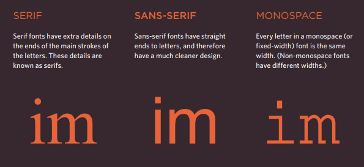
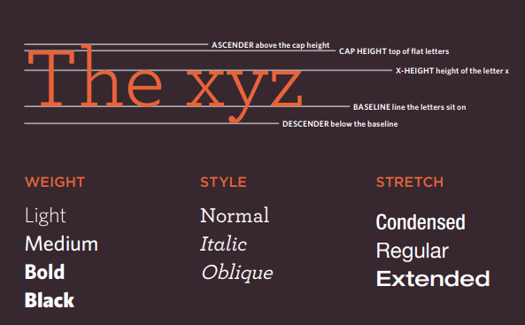

# class 05

## CSS adding image 

* The -img- element is used to add images to a web page.
* You must always specify a src attribute to indicate the source of an image and an alt attribute to describe the content of an image.
* You should save images at the size you will be using them on the web page and in the appropriate format.
* Photographs are best saved as JPEGs; illustrations or logos that use flat colors are better saved as GIFs.

## CSS color 

### Foreground Color 

The color property allows you to specify the color of text inside an element.

### background-color

CSS treats each HTML element as if it appears in a box, and the background-color property sets the color of the background for that box. 

### Understanding Color
 
 * RGB Values : Values for red, green, and blue are expressed as numbers between 0 and 255. 
 rgb(red,green,blue).

 * Hex Codes : Hex values represent values for red, green, and blue in hexadecimal cod.

 * Color Names: Colors are represented by predefined names. However, they are very limited in number. 

 * Hue : Hue is near to the colloquial idea of color. Technically speaking however, a color can also have saturation and brightness as well as hue.

 * Saturation : Saturation refers to the amount of gray in a color. At maximum saturation, there would be no gray in the color. At minimum saturation, the color would be mostly gray. 

 * Brightness : Brightness (or "value") refers to how much black is in a color. At maximum brightness, there would be no black in the color. At minimum brightness, the color would be very dark.

* Color pickers can help you find the color you want.
 
**note:** ***It is important to ensure that there is enough contrast between any text and the background color (otherwise people will not be able to read your content).***

### advices to use images 

* Use JPEG format for all images that contain a natural scene or photograph where variation in colour and intensity is smooth. Use PNG format for any image that needs transparency or for images with text & objects with sharp contrast edges like logos. Use GIF format for images that contain animations.

* **Compression** can be of two types — lossless and lossy. In lossless compression, it is possible to reconstruct the original image from the compressed image because there is no information loss during compression.  
**note:** ***JPEG is a lossy compression specification that takes advantage of human perception. It can achieve compression ratios of 1:10 without any perceivable difference in quality.**

## TEXT css

### Typeface Terminology

this is  are properties to control the choice of font, size, weight, style, and spacing.

**note:** ***There is a limited choice of fonts that you can assume most people will have installed.***

You can control the space between lines of text, individual letters, and words. Text can also be aligned
to the left, right, center, or justified. It can also be indented. also you can use pseudo-classes to change the style of an element when a user hovers over or clicks on text, or when they have visited a link.

