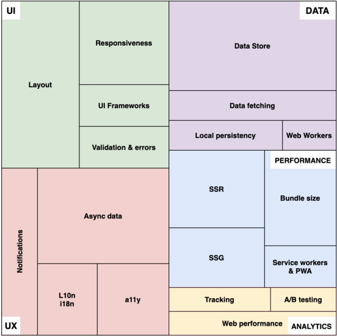

# layout :

## (div) elements 
 are often used as containing elements to group together sections of a page.
 **Note** 
 there are other element containing elements to group together sections of a page lik :

 *  (nav) defines a section that contains navigation links that appear often on a site. You can have primary and secondary menus. 

 * (article) defines a piece of self-contained content. It does not refer to the main content alone and can be used for comments and widgets.

 * (section) defines a section of a document to indicate a related grouping of semantic meaning. It makes sense to use the section element to provide extra context for the parent element.

 *  (aside) defines a section that, though related to the main element, doesn't belong to the main flow, like an explanation box or an advertisement. The aside element has its own outline, but doesn't belong to the main one.

 you have to kno that *Browsers* display pages in normal flow unless you specify relative, absolute, or fixed positioning. also  to create *multi-column* layouts you can use he float property moves content to the left or right of the page. 

 **note** : Designers keep pages within 960-1000 pixels wide, and indicate what the site is about within the top 600 pixels (to demonstrate its relevance without scrolling).

 ## CSS Frameworks provide rules for common tasks.

 is a library allowing for easier, more standards-compliant web design using the Cascading Style Sheets language

#### what its model :

* reset style sheet 
* typography 
* set of icons in sprites or icon fonts 
* ... etc 

###### example of frameworks 

**note** You can include multiple CSS files in one page.

