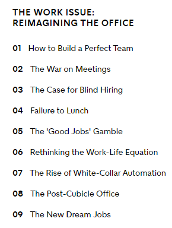

# class14a

## What Google Learned From Its Quest to Build the Perfect Team

### our data-saturated age 

enables us to examine our work habits and office quirks with a scrutiny that our cubicle-bound forebears could only dream of. 
‘‘We’re living through a golden age of understanding personal productivity,’’ says Marshall Van Alstyne,

In 2012, the company embarked on an initiative — code-named Project Aristotle — to study hundreds of Google’s teams and figure out why some stumbled while others soared. Dubey, a leader of the project, gathered some of the company’s best statisticians, organizational psychologists, sociologists and engineers. He also needed researchers. Rozovsky, by then, had decided that what she wanted to do with her life was study people’s habits and tendencies. After graduating from Yale, she was hired by Google and was soon assigned to Project Aristotle.

### Project Aristotle’s researchers:
  
  began by reviewing a half-century of academic studies looking at how teams worked.

  No matter how researchers arranged the data, though, it was almost impossible to find patterns — or any evidence that the composition of a team made any difference. ‘‘We looked at 180 teams from all over the company,’’ Dubey said. ‘‘We had lots of data, but there was nothing showing that a mix of specific personality types or skills or backgrounds made any difference. The ‘who’ part of the equation didn’t seem to matter.’’

  After looking at over a hundred groups for more than a year, Project Aristotle researchers concluded that understanding and influencing group norms were the keys to improving Google’s teams. But Rozovsky, now a lead researcher, needed to figure out which norms mattered most. 

  ## Imagine you have:

   been invited to join one of two groups.

Team A is composed of people who are all exceptionally smart and successful. When you watch a video of this group working, you see professionals who wait until a topic arises in which they are expert, and then they speak at length, explaining what the group ought to do. 

When someone makes a side comment, the speaker stops, reminds everyone of the agenda and pushes the meeting back on track. This team is efficient. 

## CSS

# Transforms

With CSS3 came new ways to position and alter elements. Now general layout techniques can be revisited with alternative ways to size, position, and change elements.

### 2D Transforms

Elements may be distorted, or transformed, on both a two-dimensional plane or a three-dimensional plane. Two-dimensional transforms work on the x and y axes, known as horizontal and vertical axes. Three-dimensional transforms work on both the x and y axes, as well as the z axis.

* 2D Rotate 

The transform property accepts a handful of different values. The rotate value provides the ability to rotate an element from 0 to 360 degrees. Using a positive value will rotate an element clockwise, and using a negative value will rotate the element counterclockwise. The default point of rotation is the center of the element, 50% 50%, both horizontally and vertically. Later we will discuss how you can change this default point of rotation.

* 2D Scale

Using the scale value within the transform property allows you to change the appeared size of an element. The default scale value is 1, therefore any value between .99 and .01 makes an element appear smaller while any value greater than or equal to 1.01 makes an element appear larger.

* 2D Translate 

The translate value works a bit like that of relative positioning, pushing and pulling an element in different directions without interrupting the normal flow of the document. Using the translateX value will change the position of an element on the horizontal axis while using the translateY value will change the position of an element on the vertical axis.

As with the scale value, to set both the x and y axis values at once, use the translate value and declare the x axis value first, followed by a comma, and then the y axis value.

The distance values used within the translate value may be any general length measurement, most commonly pixels or percentages. Positive values will push an element down and to the right of its default position while negative values will pull an element up and to the left of its default position.

for more info visit this [CSS psition ](https://learn.shayhowe.com/advanced-html-css/css-transforms/). 

### Transitions & Animations 

Animations within CSS3 allow the appearance and behavior of an element to be altered in multiple keyframes. Transitions provide a change from one state to another, while animations can set multiple points of transition upon different keyframes. 

for more info visit this [CSS psition ](https://learn.shayhowe.com/advanced-html-css/transitions-animations/). 

