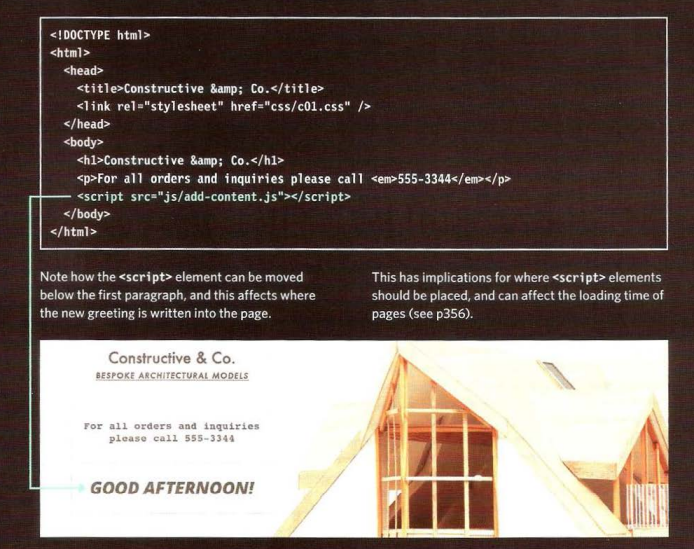

# read001

# introduction HTML

***is it hard to learn***

acthully its not hard to learn even if the screen is full of code. 
you can ask about anything you want to add, edit or too do.
remamber: google is her!

# how people accses the web ?

people accsess website using software called **web browser**

 in order to vive web page user might:
* type web address.
* follow link from another site.
* use book marks. 

### web servers 
its a spicial compputer know as web server which host the website.

### device 
which is the desktop computer, tablet, laptops and mobile phone.

### screen reader:
its the program that read out the contents of computer.

# how the website work ?

1- you connect the web using internet server provide (ISP). then you type the web adress
2- your cpmputer contact network server, its tell your computer the IP address associated 
with the requsted domain name.
note: IP address is number of up to 12 digits seprated by / fullstop.
3- the unique number that the DNS server ruterns your computer allows your browser to contact
the web server that host the website that you requested.
4- the web server send the page you requsted back to ypur web browser.

# ther aer several versions of HTML, also several version of web browser

**and becouse of this ech website should begin with a DOCTYPE declaration the type of HTML the page is useing.**

## comment in HTML
 just use < !-- comment goes her -- > and the comment wont be visable fo user.

## ID & class attribute :
the fist one use uniquely identify that elment from other elment.
but the class attribute its avalue should describe the class it belongs to.

## Block elment:
some elemant are appeare to start new line.

## inline elment:
some elment will always appear to continu on the same line.

## grouping text & elements in block:
its the div tag.

## grouping text & elements inline:
its the snap tag.

## Iframes 
its the iframe tag & to use it you have to know how to use src, hoght, width, scrolling, semmles & frameborder.

# HTML5 layout:

* The new HTML5 elements indicate the purpose of
different parts of a web page and help to describe
its structure.

* The new elements provide clearer code (compared
with using multiple 
 elements).

* Older browsers that do not understand HTML5
elements need to be told which elements are
block-level elements.

* To make HTML5 elements work in Internet Explorer 8
(and older versions of IE), extra JavaScript is needed,
which is available free from Google. 

# PROCESS & Design:

* It's important to understand who your target audience
is, why they would come to your site, what information
they want to find and when they are likely to return.

* Site maps allow you to plan the structure of a site.

* Wireframes allow you to organize the information that
will need to go on each page.

* Design is about communication. Visual hierarchy helps
visitors understand what you are trying to tell them.

* You can differentiate between pieces of information
using size, color, and style.

* You can use grouping and similarity to help simplify
the information you present.7

# what is script how do I creat one ?

you have to find your gool & decid what is the best way to achive it ?
you have to sketching out the task in a flowchat.
**flowchart**

| Genric step       | | Event             | 
|-------------------| |-------------------|
| input or output   | | Decision          | 

# how browser see a web page ?
1- the browser recive an HTML page. 
2- it creats a model of the page. 
3- its show the page.

# how do I write ascript for a web page ?

* It is best to keep JavaScript code in its own JavaScript
file. JavaScript files are text files (like HTML pages and
CSS style sheets), but they have the . j s extension.

* The HTML /<script>/ element is used in HTML pages
to tell the browser to load the JavaScript file (rather like
the /<link>/ element can be used to load a CSS file).

* If you view the source code of the page in the browser,
the JavaScript will not have changed the HTML,
because the script works with the model of the web
page that the browser has created. 

